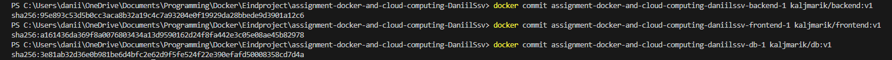

### backend

1. npm i
2. node app.js

Lokaal

Dit is een starter voor jullie assignment

### frontend

1. npm i
2. npm start

Lokaal

### Dockerizing

## Backend

Aanmaken van de DockerFile
een dockerIgnore voor node modules en log

cors moet correct ingesteld worden zodat de frontend die kan bereiken

## Frontend

Zelfde stap als backend

Juiste url instellen voor de fetch in dit geval, localhost:3000

## yaml file

yaml file aanmaken
backend service draait op poort 3000
maakt gebruik van mongo uri environment en zal pas starten nadat de db is gestart.

frontend service zal op poort 80 draaien
environment verwijst naar backend

Database pullt latest img van mongo
Slaat data op in ./data/db
draait op poort 27017
creeërt een netwerk zodat alle services kunnen communiceren op backend-network

docker-compose up --build
zal alles images maken, services starten en backend exposen op localhost:3000 en frontend op localhost

### MiniKube

voordat we beginnen met de yamls moeten we de frontend en backend images creëren en uploaden naar dockerhub

## Images

# containers runnne

Eerts de 3 containers laten runnen, kun je checken met docker ps

# docker commit

docker commit assignment-docker-and-cloud-computing-daniilssv-backend-1 kaljmarik/backend:v1

dit doen we dan ook voor de andere 2 containers
behalve database, deze mag gebruik maken van mongo:latest

# docker push

docker push your-docker-username/backend:v1
hetzelfde met de rest

# .yaml

We maken voor alle services een yaml file
deze zorgen voor de configuratie van kubernetes

## Minikube

docker container runnen
status checken: minikube status
starten: minikube start

vervolgens testen of je connectie hebt met minikube: kubectl cluster-info en met kubectl get nodes

# applying yamls naar minikube

we voeren uit:
kubectl apply -f docker/backend-deployment.yaml
kubectl apply -f docker/frontend-deployment.yaml

# verifying

kubectl get pods
kubectl get services

