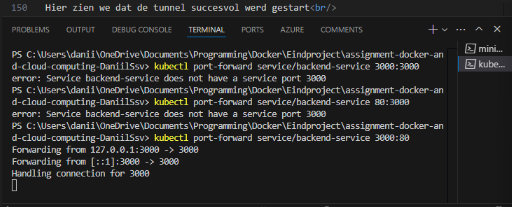
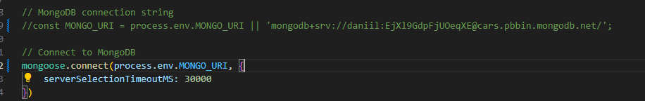

[](https://classroom.github.com/a/GyBlhhFf)
Dit is een starter voor jullie assignment

# backend

```
npm i
node app.js
```

Lokaal<br/>


# frontend

```
npm i
npm start
```

Lokaal<br/>


# Dockerizing

## Backend

Aanmaken van de DockerFile<br/>
een dockerIgnore voor node modules en log

cors moet correct ingesteld worden zodat de frontend die kan bereiken

## Frontend

Zelfde stap als backend

Juiste url instellen voor de fetch in dit geval, localhost:3000

# yaml file

yaml file aanmaken<br/>
backend service draait op poort 3000<br/>
maakt gebruik van mongo uri environment en zal pas starten nadat de db is gestart.

frontend service zal op poort 80 draaien<br/>
environment verwijst naar backend

Database pullt latest img van mongo<br/>
Slaat data op in ./data/db<br/>
draait op poort 27017<br/>
creeërt een netwerk zodat alle services kunnen communiceren op backend-network

docker-compose up --build<br/>
zal alles images maken, services starten en backend exposen op localhost:3000 en frontend op localhost. Het is belangrijk om te weten dat ookal is je backend bereikbaar op http://backend:3000/car-brands. Je MOET in app localhost gebruiken omdat de react niet in de container zelf runt, maar op je browser en die heeft daar geen toegang toe.


# MiniKube

voordat we beginnen met de yamls moeten we de frontend en backend images creëren en uploaden naar dockerhub

## Images

### containers runnen

Eerts de 3 containers laten runnen, kun je checken met docker ps

### docker commit

```
docker commit assignment-docker-and-cloud-computing-daniilssv-backend-1 kaljmarik/backend:v1
```

dit doen we dan ook voor de andere 2 containers<br/>
behalve database, deze mag gebruik maken van mongo:latest


### docker push

Nu dat alles gecommit is kunnen we de laatste versie pushen naar dockerhub

```
docker push your-docker-username/backend:v1
```

We doen hetzelfde met de rest


### .yaml

We maken voor alle services een yaml file<br/>
deze zorgen voor de configuratie van kubernetes

## Minikube

starten: `minikube start` <br/>
status checken: `minikube status` <br/>

vervolgens testen of je connectie hebt met minikube

```
kubectl cluster-info
kubectl get nodes
```

### applying yamls naar minikube

we voeren uit:

VOLGORDE IS BELANGRIJK

```
kubectl apply -f docker/mongo-deployment.yaml
kubectl apply -f docker/backend-deployment.yaml
kubectl apply -f docker/frontend-deployment.yaml
```


## verifiëren

```
kubectl get pods
kubectl get services
```


Het is belangrijk dat je een tunnel opent voor minikube. Minikube support geen loadbalancer services. Om onze front-end te bereiken moeten we een tunnel openen.

commando:

```
minikube tunnel
kubectl port-forward service/backend-service 3000:80
```

Beide moeten ook altijd blijven runnen op een openstaande terminal anders verbreekt de connectie, hier zetten we ook de poort open van de api open zodat deze ook extern beschikbaar is. Anders krijgen we een probleem waarbij er geen connectie is tussen de 2.<br/>




Hierna voeren we nog eens de `kubectl get services` uit.<br/>
Het is de bedoeling dat je nu ook de externe ip ziet van de loadbalancer.<br/>
Met deze ip kan je in uw browser de frontend bereiken.

Zie screenshots


Hier zien we dat de tunnel succesvol werd gestart<br/>
Tijdens het ophalen van de services zien we dat de externe ip niet op loading staat maar effectief een ip heeft gekregen.<br/>

De connectie tussen de 2 testen we ook nog eens lokaal via kubectl.<br/>
Dit doen we met behulp van deze commando's:<br/>

```
kubectl exec -it frontend-deployment-5cf9cbc856-r7h68 -- env | Select-String REACT_APP_API_URL
kubectl exec -it frontend-deployment-5cf9cbc856-r7h68 -- curl http://10.244.0.73:3000/car-brands
```

Hier maken we gebruik van de frontend pod naam en de curl verwijst naar de pod cluster ip



We builden en pushen het opnieuw naar dockerhub<br/>
Nu werkt alle scorrect bij het builden van de dockercompose en maakt het gebruik van de db in container en niet atlas.

Het is mogelijk dat de backend niet direct runt of errort, dit kan zijn omdat de db nog niet opgesteld is binnen minikube, geef het wat tijd.

Om de app te bereiken kan dit van pas komen:

```
minikube service frontend-service --url
```


