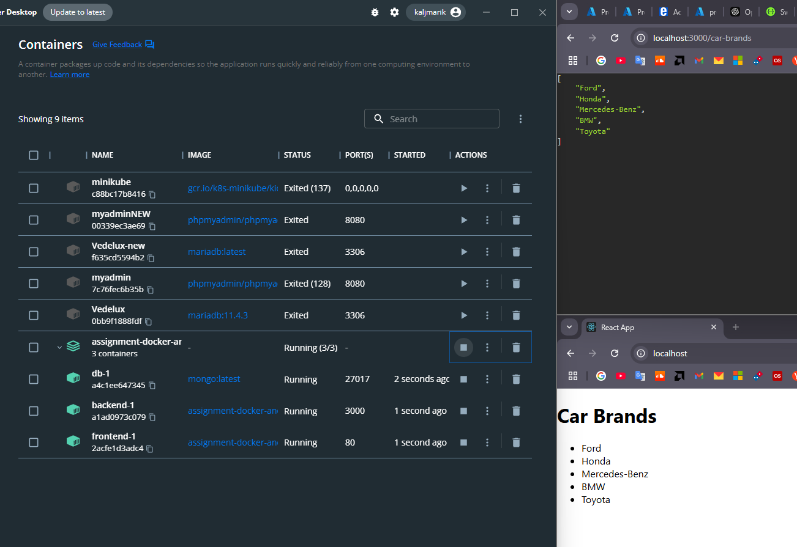
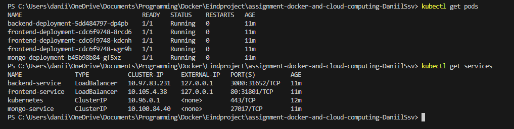
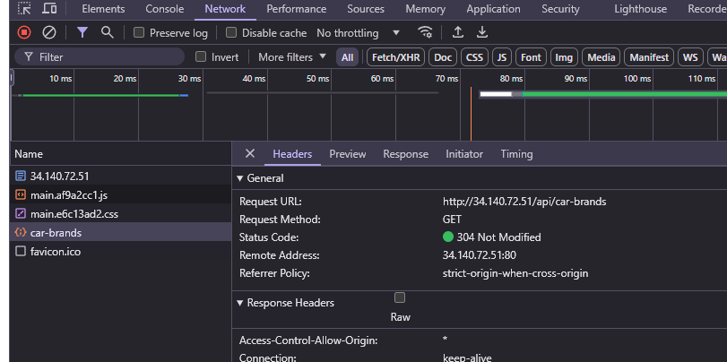

# Getting Started
## backend Local
### install dependencies:
```bash
npm i
```

### start the backend server:
```bash
node app.js
```

### Local env


## frontend
### install dependencies:
```bash
npm i
```

### start the frontend server
```bash
npm start
```

### Local env


# Dockerizing the application
## Backend

- Creeër een `Dockerfile` en een `.dockerignore` om de `node_modules` en logs uit te sluiten
- Stel CORS in

## Frontend

- Zelfde stappen als bij backend
- Juiste url instellen voor de fetch in dit geval, localhost:3000

## Docker Compose
- Maak een `docker-compose.yaml` met de juiste configuratie

### backend
draait op 3000, gebruikt mongodb uri als env var en wacht tot mongo opstart

### frontend
draait op 80, gebruikt nginx en wacht op backend

### mongoDB
bewaard data in ./data/db, werkt op poort 27017

maak een netwerk aan voor service communicatie
### starten
```bash
docker-compose up --build
```

- backend te vinden op localhost:3000
- frontend te vinden op localhost
De app haalt data op van localhost:3000 omdat react app in de browser draait en niet in de container



# Deploying with MiniKube
## Preparing Docker Images
1. draai de containers lokaal en verifieer met
```bash
docker ps
```

2. commit de draaiende containers met
```bash
docker commit assignment-docker-and-cloud-computing-daniilssv-backend-1 kaljmarik/backend:v1
```

3. push de gecommitte images naar Docker Hub
```bash	
docker push your-docker-username/backend:latest
```
Bij stap 2 en 3 voer je hetzelfde uit voor de andere containers
In mijn project maak ik geen gebruik van eigen mongoDB image, maar die staat wel beschikbaar op Docker Hub


## YAML Files
1. Maak deployment files voor alle services
- ConfigMap
- services
- deployments

## Deployment
1. MiniKube starten: `minikube start` <br/>
2. status checken: `minikube status` <br/>
3. connectie testen: `kubectl cluster-info` en `kubectl get nodes`

### Apply YAML files in order
VOLGORDE IS BELANGRIJK

Eerst voeren we de configuratie en services uit.
```bash
kubectl apply -f k8s/configMap.yaml
kubectl apply -f k8s/services.yaml
```

Vervolgens deployen we de apps
```bash
kubectl apply -f k8s/mongo-deployment.yaml
kubectl apply -f k8s/frontend-deployment.yaml
kubectl apply -f k8s/backend-deployment.yaml
```

## Verifying

We testen indien de loadbalancer 3 pods kan maken voor de scalability en of ze werken
```bash
kubectl get pods
kubectl get services
```



Het is belangrijk dat je een tunnel opent voor minikube. Minikube support standaard geen loadbalancer services. Om onze front- en backend te bereiken moeten we een tunnel openen.
```bash
minikube tunnel
```


Zie onderstaande image dat de frontend bereikbaar staat op 3 ip's omdat we 3 replicas hebben ingesteld.


Na meerdere browsers en refreshes zien wij dat er in verschillende pods logs te zien zijn dat ze bereikt waren.


We voeren nog eens de get services uit om aan te tonen dat er maar 1 draait.


### Success


Indien nodig kun je ook de connectie testen tussen de pods door kubectl exec -it. Je voert dan een curl naar de nodige pod uit


Het is mogelijk dat de backend niet direct runt of errort, dit kan zijn omdat de db nog niet opgesteld is binnen minikube, geef het wat tijd.

# Google Cloud Deployment
## Steps
1. Project aanmaken
2. Kubernetes Engine API aanzetten
3. Cluster aanmaken met goeie kost efficiënte settings die onze applicatie kan draaien<br/>
Het kan eventjes duren in begin


4. Verbinden met de cluster
```bash
gcloud container clusters get-credentials cluster-1 --zone europe-west1-b --project myreactapp-445621
```

5. connectie testen

```bash
kubectl get nodes
```


6. deployen
We volgen dezelfde stappen als bij MiniKube namelijk de volgorde van deployment, later zal dit sneller gebeuren met helm


Bewijs


## Fout

Ik had namelijk gebruik gemaakt van localhost tot aan hier, maar dit kon verder niet omdat voor kubernetes er dan een verkeerde fetch uitgevoerd werd. Heb dit opgelost door een proxy in te stellen voor de api door gebruik te maken van nginx.

Zie screenshot voor routering.




Om te switchten tussen kubectl van google en minikube gebruik je:

```bash
kubectl config get-contexts
kubectl config use-context minikube
```

### Scalen

Scaling werkt, maar deze werd nu verlaagt om de kost te verminderen

```bash
kubectl scale deployment frontend-deployment --replicas=1
```

# HELM

We verwijderen onze vorige oplossing, want helm moet toegang hebben tot de configuratie en dit kan enkel in geval dat hij het heeft aangemaakt<br/>

1. Verwijder alle resources `kubectl delete all --all`<br/>

2. Deployen met helm ` helm upgrade --install car-app ./car-app-1.0.0.tgz`

## Repository

```bash
helm repo add stable https://charts.helm.sh/stable
helm repo update
```

## Configure Environments
### Production

```bash
kubectl create namespace production
helm upgrade --install car-app ./car-app-1.0.0.tgz -f values-production.yaml --namespace production
```

### Test

```bash
kubectl create namespace testing
helm upgrade --install car-app-test ./car-app-1.0.0.tgz -f values-test.yaml --namespace testing
```

om alles te verwijderen binnen de namespace typ je: `kubectl delete all --all --namespace <namespace>`


# CI/CD
Voor dit te kunnen uitvoeren moet je toegang hebben tot de respository  op github

1. Voeg Cloud Deploy Api toe aan je project
2. Maak een nieuwe delivery pipeline en target de juiste cluster
3. Trigger creëren in Cloud Build voor alle branches "\*"
4. Install google cloud in je repository
5. Bij configuratie verwijs je naar cloudbuild.yaml in mijn geval is dat /Helm/cloudbuild.yaml.

Nu alles klaar is, zal je bij ieder nieuw update op gelijk welke branch op de aangeduide Github repo. In uw cloud build history komt een update te zien die automatisch wordt aangepast tenzij je het op manueel instelt en dan moet je het nog accepteren.


## Trigger CI/CD


# Monitoring with Prometheus en Grafana

Voegen prometheus toe

```bash
helm repo add prometheus-community https://prometheus-community.github.io/helm-charts
helm repo update
```

installen

```bash
helm install prometheus prometheus-community/kube-prometheus-stack --namespace monitoring
```

By default zal deze geïnstalleerd staan in de namespace default daarom specifieren we een namespace, maak die ook eerst aan.

services patchen en naar loadbalancer omzetten, je voert volgende commando uit, pas type aan en save

```bash
kubectl edit svc prometheus-kube-prometheus-prometheus -n monitoring
kubectl edit svc prometheus-grafana -n monitoring
```


We loggen in met
Login: admin
Password: prom-operator


om Prometheus te zien openen wij de prometheus / overview


Zoals we zien krijgen we al meerdere dashboard te zien. Deze werden automatisch geconfigureerd.

Grafana toont enkel dashboard en haalt geen data op.<br/>
We weten ook dat Google zelf geen data geeft vanuit de cluster, dus kunnen we er vanuit gaan dat alle data die we zien afkomstig is van prometheus.

Een veel makkelijker manier om je clusters te bekijken is door gebruik te maken van google monitoring, deze gebeurd automatisch.

## Problemen

Terugkerende naar mijn helm, had ik blijkbaar values verkeerd ingesteld en dat was omdat ik prettier had staan in visual studio.
Deze veroorzaakte verkeerde indentatie met tabs en liet spatie tussen { { } }, Helm heeft dit niet graag en zal niet correct werken.

Helm kun je ook niet meer via Google Cloud Packages zelf installeren dus deze moet je dan zelf ophalen van Github

Hier zien we dat de deployment gelukt is meerdere pogingen
Indien je ci/cd uit wil zetten dan druk je op stop streaming builds


