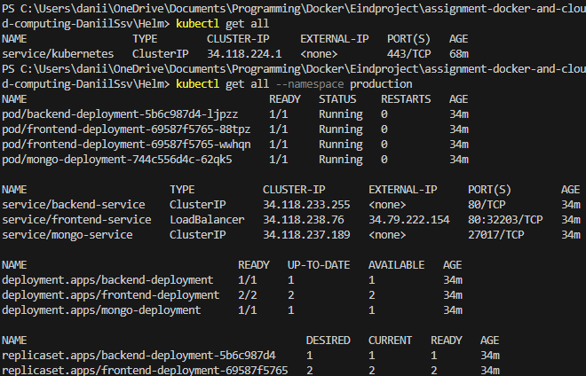

[](https://classroom.github.com/a/GyBlhhFf)
Dit is een starter voor jullie assignment

# backend

```bash
npm i
node app.js
```

Lokaal<br/>


# frontend

```bash
npm i
npm start
```

Lokaal<br/>


# Dockerizing

## Backend

Aanmaken van de DockerFile<br/>
een dockerIgnore voor node modules en log

cors moet correct ingesteld worden zodat de frontend die kan bereiken

## Frontend

Zelfde stap als backend

Juiste url instellen voor de fetch in dit geval, localhost:3000

# yaml file

yaml file aanmaken<br/>
backend service draait op poort 3000<br/>
maakt gebruik van mongo uri environment en zal pas starten nadat de db is gestart.

frontend service zal op poort 80 draaien<br/>
environment verwijst naar backend

Database pullt latest img van mongo<br/>
Slaat data op in ./data/db<br/>
draait op poort 27017<br/>
creeërt een netwerk zodat alle services kunnen communiceren op backend-network

docker-compose up --build<br/>
zal alles images maken, services starten en backend exposen op localhost:3000 en frontend op localhost. Het is belangrijk om te weten dat ookal is je backend bereikbaar op http://backend:3000/car-brands. Je MOET in app localhost gebruiken omdat de react niet in de container zelf runt, maar op je browser en die heeft daar geen toegang toe.


# MiniKube

voordat we beginnen met de yamls moeten we de frontend en backend images creëren en uploaden naar dockerhub

## Images

### containers runnen

Eerts de 3 containers laten runnen, kun je checken met docker ps

### docker commit

```bash
docker commit assignment-docker-and-cloud-computing-daniilssv-backend-1 kaljmarik/backend:v1
```

dit doen we dan ook voor de andere 2 containers<br/>
behalve database, deze mag gebruik maken van mongo:latest


### docker push

Nu dat alles gecommit is kunnen we de laatste versie pushen naar dockerhub

```bash
docker push your-docker-username/backend:v1
```

We doen hetzelfde met de rest


### .yamls

We maken voor alle services een yaml deployment file<br/>
We maken een ConfigMap voor front en backend, deze geven de url mee voor connectie<br/>
Er zijn geen secrets nodig en binnen de services.yaml vind je nodige instellingen voor alle 3 de services

## Minikube

starten: `minikube start` <br/>
status checken: `minikube status` <br/>

vervolgens testen of je connectie hebt met minikube

```bash
kubectl cluster-info
kubectl get nodes
```

### applying yamls naar minikube

VOLGORDE IS BELANGRIJK, anders moet je bepaalde pods restarten of wachten tot zij dat zelf doen.

Eerst voeren we de configuratie en services uit.

```bash
kubectl apply -f k8s/configMap.yaml
kubectl apply -f k8s/services.yaml
```

Vervolgens deployen we de apps

```bash
kubectl apply -f k8s/mongo-deployment.yaml
kubectl apply -f k8s/frontend-deployment.yaml
kubectl apply -f k8s/backend-deployment.yaml
```

## verifiëren

In ons geval testen we indien de loadbalancer 3 pods kan maken voor de scalability en of ze werken

```bash
kubectl get pods
kubectl get services
```


Het is belangrijk dat je een tunnel opent voor minikube. Minikube support standaard geen loadbalancer services. Om onze front- en backend te bereiken moeten we een tunnel openen.

```bash
minikube tunnel
```


Zie onderstaande image dat de frontend bereikbaar staat op 3 ip's omdat we 3 replicas hebben ingesteld.


Na meerdere browsers en refreshes zien wij dat er in verschillende pods logs te zien zijn dat ze bereikt waren.


We voeren nog eens de get services uit om aan te tonen dat er maar 1 draait.


### Success


Indien nodig kun je ook de connectie testen tussen de pods door kubectl exec -it. Je voert dan een curl naar de nodige pod uit


Het is mogelijk dat de backend niet direct runt of errort, dit kan zijn omdat de db nog niet opgesteld is binnen minikube, geef het wat tijd.

# Deployment Google Cloud

## stappen

- Project aanmaken
- Kubernetes engine aanzetten
- vervolgens clusters aanmaken

We kiezen voor de meest goedkope GKE, maar wel een die genoeg is voor onze applicatie te draaien

- connecten


Het duurt even tegen dat de cluster online staat

```bash
gcloud container clusters get-credentials cluster-1 --zone europe-west1-b --project myreactapp-445621
```

- connectie testen

```bash
kubectl get nodes
```


- deployen

Eerst de configmap daarna services en dan de deployments
Nu applyen we eerst de configmap, die kun je dan testen met `kubectl get configmaps`.

Eerst deployen we MongoDB daarna backend en dan pas frontend


Bewijs


## probleem

Ik had namelijk gebruik gemaakt van localhost tot aan hier, maar dit kon verder niet omdat voor kubernetes er dan een verkeerde fetch uitgevoerd werd. Heb dit opgelost door een proxy in te stellen voor de api door gebruik te maken van nginx.

Zie screenshot voor routering.


Om te switchten tussen kubectl van google en minikube gebruik je:

```bash
kubectl config get-contexts
kubectl config use-context minikube
```

### Scalen

Scaling werkt, maar deze werd nu verlaagt om de kost te verminderen

```bash
kubectl scale deployment frontend-deployment --replicas=1
```

# HELM

We verwijderen onze vorige oplossing, want helm moet toegang hebben tot de configuratie.<br/>

Je verwijderd alles zodat helm toegang kan krijgen bij het opnieuw aanmaken van je project `kubectl delete all --all`<br/>

nu kun je de helm deployen met ` helm upgrade --install car-app ./car-app-1.0.0.tgz`. Let op dat de naam correct staat met wat er in de Chart.yaml zit.

## Repository

```bash
helm repo add stable https://charts.helm.sh/stable
helm repo update
```

## Environments

### Production

```bash
kubectl create namespace production
helm upgrade --install car-app ./car-app-1.0.0.tgz -f values-production.yaml --namespace production
```

### Test

```bash
kubectl create namespace testing
helm upgrade --install car-app-test ./car-app-1.0.0.tgz -f values-test.yaml --namespace testing
```

om alles te verwijderen typ je: `kubectl delete all --all --namespace <namespace>`



# CI/CD

- Je voegt cloud deploy api toe aan je project
- Create new delivery pipeline
- kies de juiste target cluster

Je moet toegang hebben tot de repository

- trigger creëren in cloud build
- install google cloud in je repository
- bij branches type je "\*" om alle branches te controleren op wijzigingen

- bij configuratie verwijs je naar cloudbuild.yaml in mijn geval is dat /Helm/cloudbuild.yaml.

Nu is alles klaar en zal je bij ieder nieuw versie op github in uw history een update zien die je kan reviewen en dan accepteren of wijgeren om te updaten.


## Trigger CI/CD


# Prometheus en Grafana

Voegen prometheus toe

```bash
helm repo add prometheus-community https://prometheus-community.github.io/helm-charts
helm repo update
```

installen

```bash
helm install prometheus prometheus-community/kube-prometheus-stack
```

By default zal deze geïnstalleerd staan in de namespace default

services patchen en naar loadbalancer omzetten, je voert commando uit, pas type aan en saved

```bash
kubectl edit svc prometheus-kube-prometheus-prometheus
kubectl edit svc prometheus-grafana
```


We loggen in met
Login: admin
Password: prom-operator


om Prometheus te zien openen wij de prometheus / overview


## Problemen

Terug kerende naar mijn helm, had ik blijkbaar verkeerd ingesteld en dat was omdat ik prettier had staan in visual studio.
Deze veroorzaakte verkeerde indentatie met tabs en liet spatie tussen { { } }, blijkbaar was helm case sensitive.

Helm kun je ook niet meer via google cloud packages zelf installen dus deze moet je dan zelf ophalen van github

Hier zien we dat de deployment gelukt is meerdere pogingen


